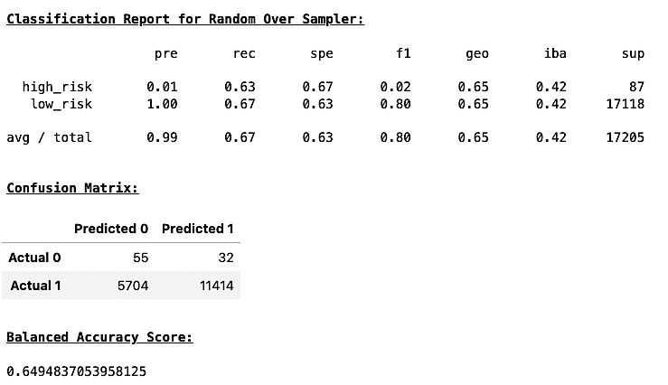
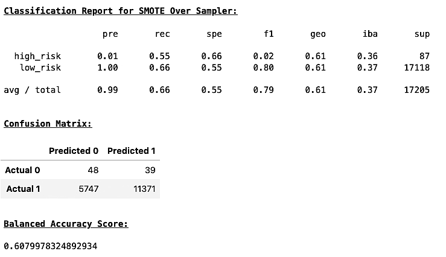
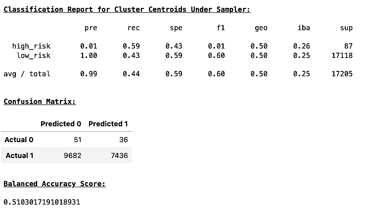
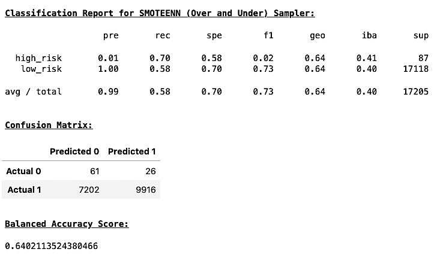
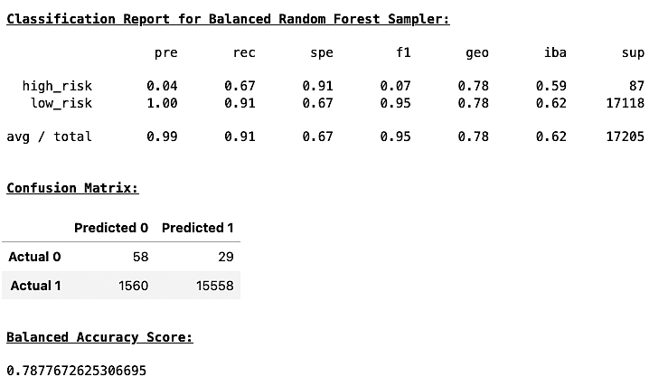
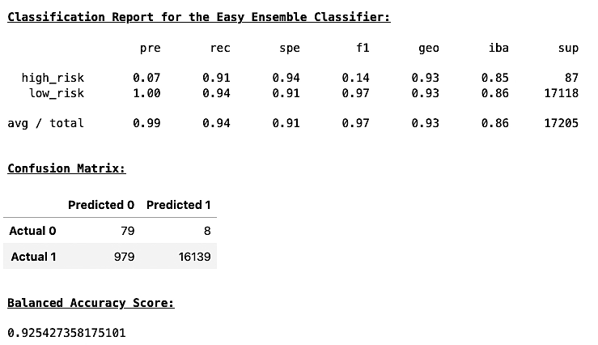
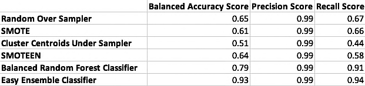

# Credit Risk Analysis

## Overview

This project uses the credit card credit dataset from LendingClub to over-sample the data using the RandomOverSampler and SMOTE algorithms, and under-sample the data using the ClusterCentroids algorithm in the notebook `credit_risk_resampling.ipynb`.

Next the notebook uses a combination of over and under-sampling using the SMOTEEN algorithm on the same dataset.

The notebook, `credit_risk_ensemble.ipynb` takes the same dataset to compare two machine learning models to reduce bias using the BalancedRandomForestClassifier and EasyEnsembleClassifier objects from the imbalance-learn library to predict credit risk.

This report will evaluate the performance of these models followed by a recommendation on which models would be best for predicting credit risk.

## Results

The following list shows the results of the balanced accuracy scores and the precision and recall scores of all six machine learning models.

- Random Over Sampler

    

  - Balanced Accuracy Score: 0.65
  - Precision Score: 0.99
  - Recall Score: 0.67
  

- SMOTE

    

  - Balanced Accuracy Score: 0.61
  - Precision Score: 0.99
  - Recall Score: 0.66
  

- Cluster Centroids

    

  - Balanced Accuracy Score: 0.51
  - Precision Score: 0.99
  - Recall Score: 0.44
  

- SMOTEENN

  

  - Balanced Accuracy Score: 0.64
  - Precision Score: 0.99
  - Recall Score: 0.58
  

- Balanced Random Forest Classifier

    

  - Balanced Accuracy Score: 0.79
  - Precision Score: 0.99
  - Recall Score: 0.91
  

- Easy Ensemble Classifier

    

  - Balanced Accuracy Score: 0.93
  - Precision Score: 0.99
  - Recall Score: 0.94
  

## Summary

The following table shows the results for all 6 of our models. The classifier models easily outperformed the random sampling models with the Random Over Sampler slightly outperforming the SMOTEEN sampler.

Even though the Balanced Random Forest Classifier performed really well compared to the random samplers, the Easy Ensemble Classifier had the best results overall and is the recommended model for predicting credit risk.

